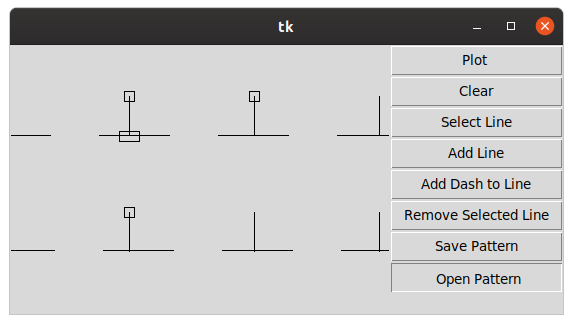

# pattern_definition_editor

This is a simple editor for pattern definitions that
could be used by `ezdxf` library to create custom 
pattern definition to fill polygons.



Select line to edit by hitting 'Select Line' and then clicking on the desire line.

By moving rectangular control anchors you can change origin point of the line, its angle, offset.

If you want selected line to has dashed pattern click 'Add Dash to Line' it will make 
line 'dashed' and it will also add another one control anchor.

It saves pattern definition as lists via `pickle` module. You can open saved files to edit them later.
Or, you can use them in `ezdxf` like this:

``` python
import pickle

import ezdxf

# load pattern definition from file
filename = '/tmp/pd.pickle'
with open(filename, 'rb') as f:
    pattern_definition = pickle.load(f)

doc = ezdxf.new('R2010')
msp = doc.modelspace()
hatch = msp.add_hatch()
hatch.set_pattern_fill('MY_PATTERN',
                       definition=pattern_definition,
                       scale=0.01
                       )
hatch.paths.add_polyline_path(
    [(0, 0), (0, 3), (3, 6), (6, 6), (6, 3), (3, 0)],
    )
doc.saveas('/tmp/example.dxf')  # save DXF drawing
```

This will produce hatched pattern that is supported at least by AutoCad and QCad:


## Requirements

python3.7
